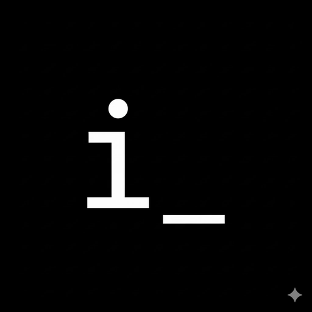

---

## Changelog

### v1.7+ - Latest Updates
- **Native Desktop App**: Full Electron desktop application with portable distribution
- **UI Enhancements**: Clean interface without menu bar distraction
- **Build System**: Improved packaging with electron-packager for better portability
- **Bug Fixes**: 
  - Fixed memory leaks and resource management
  - Improved connection validation system
  - Enhanced straight-line connections with dots
- **New Features**:
  - Content aggregation capabilities
  - Automatic title generation
  - Enhanced UI components

### v1.6 - Node Features
- Group nodes added
- Enhanced node management system

### v1.5 - Tab Support
- Multiple canvas tabs
- Tab search and drag-and-drop functionality
- UI refinements

### v1.3 - Enhanced Features
- Improved connection system with straight lines and dots
- Better memory management
- UI component improvements

### v1.1 - Foundation
- Initial mind mapping functionality
- Basic infinite canvas
- Markdown support